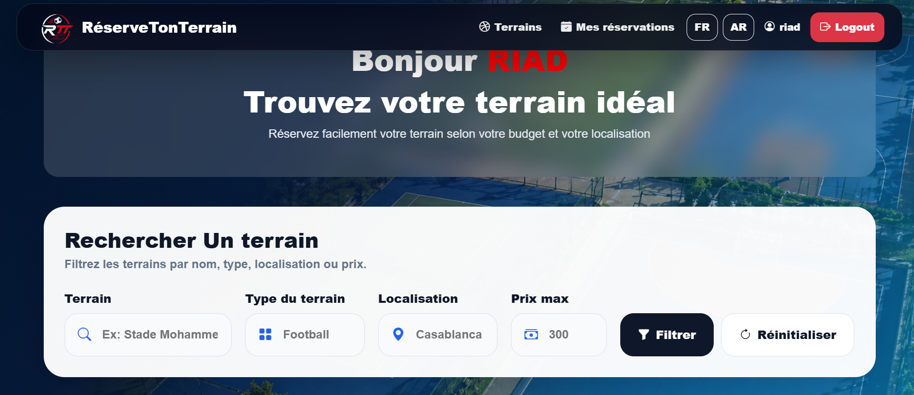
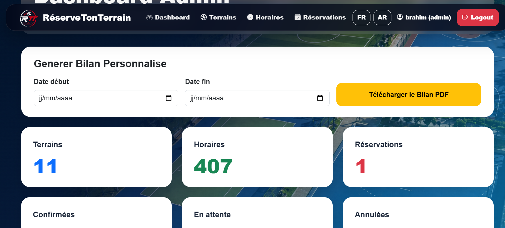
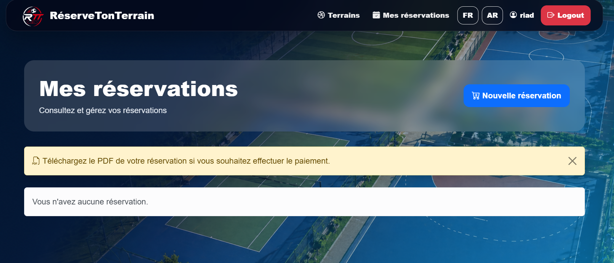

# RéserveTonTerrain

Application web de réservation de terrains sportifs développée avec Laravel.

---

## Technologies utilisées 🛠️

- PHP 8
- Laravel
- MySQL
- Bootstrap 5
- JavaScript

---

## Fonctionnalités ✨

- Authentification Admin / Client
- Gestion des terrains
- Gestion des horaires
- Réservation des terrains
- Dashboard administrateur
- Confirmation des réservations
- Interface responsive moderne

---

## Installation ⚙️

```bash
git clone https://github.com/brahimharith3/reservetonterrain.git

cd reservetonterrain

composer install

cp .env.example .env

php artisan key:generate

php artisan migrate

php artisan serve
```

---

## Captures d'écran 📸

### Page d'accueil



### Dashboard Admin



### Réservation



---

## Auteur 👤

Brahim Harith
